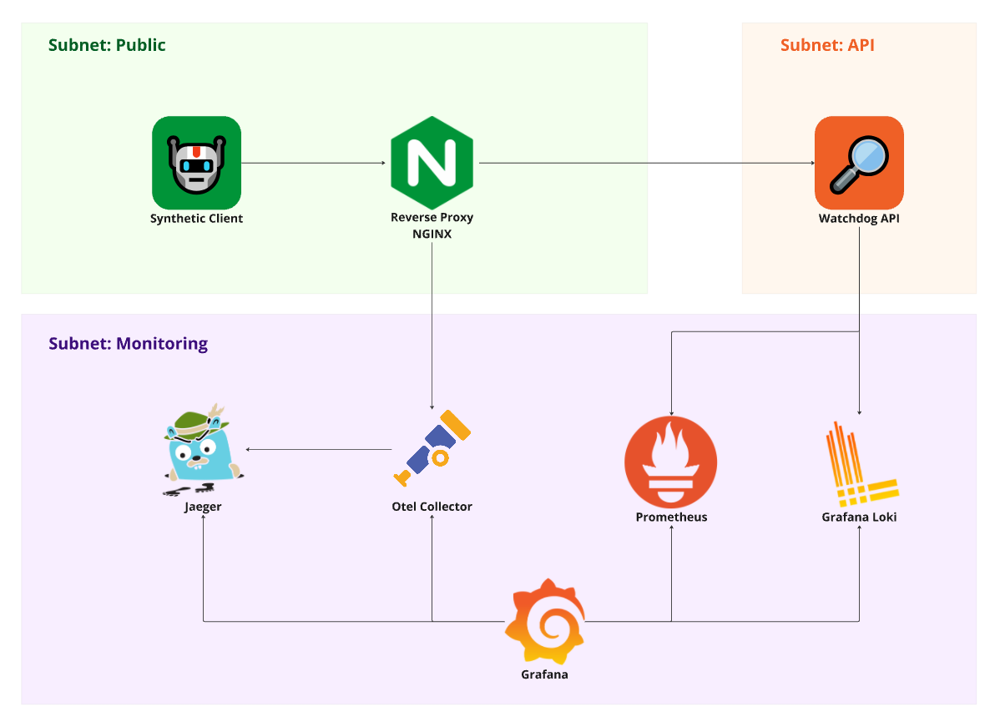
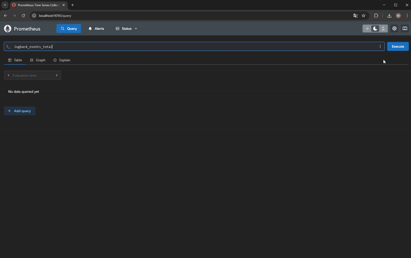
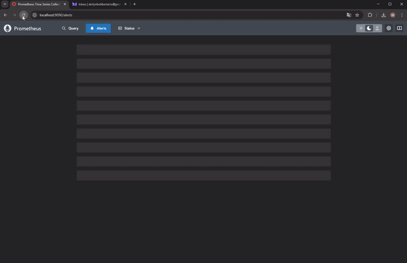
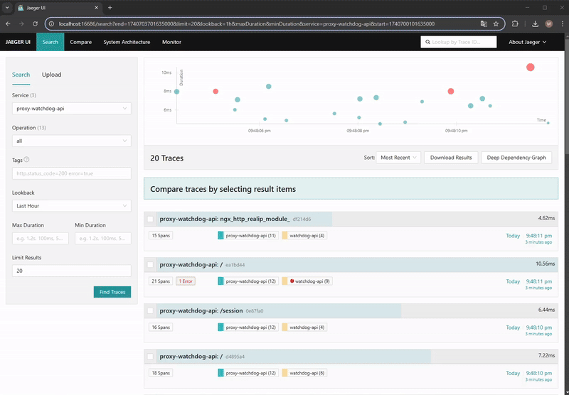

<h1 align="center">🔎 Watchdog API </h1>

<p align="center">
  WatchdogAPI é um projeto pessoal criado para praticar e compartilhar conceitos de observabilidade e monitoramento em Node.js. Esta API simples gera logs, métricas e traces, permitindo uma visão completa do seu funcionamento em tempo real. 
</p>

<p align="center">
  
</p>

## 📚 Conceitos Abordados

Antes de seguirmos para os componentes do monitoramento, é importante entender o que é SRE.

### SRE (Site Reliability Engineering)

SRE é um framework que busca garantir que sistemas, sites e softwares sejam **confiáveis** e **altamente disponíveis**. Para alcançar esses objetivos, ele adota **práticas**, **princípios** e **ferramentas** que ajudam a manter a estabilidade dos serviços.

Alguns princípios essenciais do SRE que orientam a construção de um monitoramento eficaz incluem:

- **SLO (Service Level Objective - Objetivo de Nível de Serviço):** Define a meta de disponibilidade da aplicação. Por exemplo, um SLO de 99% significa que a aplicação deve estar disponível 99% do tempo.
- **Error Budget (Orçamento de Erros):** Determina quanto tempo de indisponibilidade é aceitável. Se o SLO for 99%, o error budget será 1%, indicando que a aplicação pode ficar fora do ar por até 1% do tempo.
- **SLI (Service Level Indicator - Indicador de Nível de Serviço):** Conjunto de métricas que permitem avaliar se o SLO está sendo cumprido. Exemplos incluem taxa de erros, latência e número de requisições bem-sucedidas, que ajudam a mensurar a disponibilidade da aplicação.

Esses princípios já são suficientes para avançarmos neste projeto. Caso queira se aprofundar mais em SRE, recomendo a leitura do [workbook](https://sre.google/workbook/how-sre-relates/) da Google e do documento sobre [SLOs](https://sre.google/workbook/slo-document/) da Google.

### Observabilidade

Aplicações modernas são compostas por diversos componentes, APIs, microserviços e sistemas distribuídos, o que pode dificultar a análise quando ocorre algum problema. A observabilidade busca fornecer dados e informações que permitam entender o estado e o comportamento da aplicação, bem como todos os componentes que fazem parte da infraestrutura do serviço.

Com isso, é possível identificar gargalos de desempenho, explorar o uso de hardware e diagnosticar erros desconhecidos.

A observabilidade é composta por três pilares principais:

- **Logs:** Registros de eventos, erros e operações do sistema. É importante estruturá-los e padronizá-los para garantir informações essenciais e facilitar a análise da jornada de execução das aplicações.
- **Métricas:** Dados numéricos coletados dentro de uma série temporal, permitindo acompanhar o comportamento da aplicação em períodos definidos. Exemplos comuns incluem métricas de CPU, latência, número de requisições e erros.
- **Traces:** Rastreamento de transações end-to-end dentro da aplicação, permitindo identificar gargalos de desempenho e dependências entre serviços.

Este projeto implementa os três pilares da observabilidade para garantir uma análise detalhada do sistema.

### Monitoramento

Após tornar a aplicação observável, é possível implementar o monitoramento contínuo para acompanhar a saúde do sistema. Isso inclui a análise de **SLIs** e regras de negócio por meio de dashboards, além da configuração de alertas para notificar as pessoas responsáveis quando ocorrerem problemas, como:

- Serviços fora do ar
- Estouro de memória
- Queda no volume de dados em períodos de pico de acesso

O monitoramento tem os seguintes objetivos principais:

- **Reagir a problemas** conhecidos por meio de alertas
- **Permitir o acompanhamento de dados** através de gráficos e dashboards
- **Reduzir o tempo de detecção de problemas**, medir impacto e otimizar a análise da causa raiz

Agora que entendemos o que é **observabilidade** e **monitoramento**, podemos explorar as ferramentas utilizadas neste projeto.

## ⚙️ Ferramentas

<div style="display: flex; align-items: center; gap: 10px; padding-bottom: 18px; padding-top: 6px;">
  
  <h3 style="margin: 0;">Prometheus</h3> 
</div>

O Prometheus é uma ferramenta de **monitoramento** e **observabilidade** usada para coletar e armazenar séries temporais identificadas como métricas, organizadas em pares chave-valor. Essas séries temporais podem ser armazenadas localmente no banco de dados embutido do Prometheus ou em um armazenamento remoto.

Ele suporta diversos exporters para coletar métricas. Neste projeto, o Prometheus coleta e armazena métricas do **node-exporter** e da aplicação **WatchdogAPI**.

A partir dessas séries temporais armazenadas, é possível:

- Analisar e filtrar métricas utilizando consultas avançadas
- Gerar alertas para problemas através da integração com o Alertmanager
- Visualizar os dados em tempo real integrando com o Grafana

<p align="center">

</p>

Para mais informações, acesse a página do [**Prometheus**](https://prometheus.io/docs/introduction/overview/).

<div style="display: flex; align-items: center; gap: 10px; padding-bottom: 18px; padding-top: 30px;">
  
  <h3 style="margin: 0;">Node Exporter</h3> 
</div>

O **Node Exporter** é um exportador de métricas para o **Prometheus**, utilizado para monitorar a infraestrutura de servidores, coletando métricas de desempenho e informações sobre o estado do servidor.

Por padrão, o Node Exporter coleta diversas métricas que são essenciais para o monitoramento da saúde do servidor. Neste projeto, estamos utilizando algumas dessas métricas, como o uso de **memória** e **CPU**.

O **Node Exporter** expõe essas métricas em um endpoint HTTP, que o **Prometheus** consulta periodicamente para armazenar e analisar os dados.

Para mais informações, acesse o repositório oficial do Node Exporter: [Node Exporter no GitHub](https://github.com/prometheus/node_exporter).

<div style="display: flex; align-items: center; gap: 10px; padding-bottom: 18px; padding-top: 30px;">
  
  <h3 style="margin: 0;">Alert Manager</h3> 
</div>

O **Alert Manager** é um componente do Prometheus responsável por gerenciar os alertas quando as condições definidas nas métricas do Prometheus são atendidas. Ele recebe os dados e encaminha as notificações para os canais configurados, como Slack, Email, Discord, entre outros.

O Alert Manager permite:

- Agrupar alertas para evitar o envio excessivo de notificações.
- Silenciar alertas, o que é útil quando o sistema está em manutenção ou quando a equipe já está trabalhando na resolução de um erro.
- Enviar alertas para diferentes canais, com a possibilidade de configurar canais específicos de acordo com o nível de severidade.
- Por ser um componente do Prometheus, permite centralizar as configurações de alerta de diferentes exporters.

Neste projeto, estaremos notificando por **email** dois alertas:

- **SLO Break**: Alerta quando 90% das requisições forem maiores que 500ms nos últimos 1 minuto.
- **ERROR 500**: Alerta quando o volume de erros 500 for maior que 20% no total de requisições nos últimos 5 minutos.

<p align="center">

</p>

Para mais informações, acesse a página do Prometheus sobre o [**Alert Manager**](https://prometheus.io/docs/alerting/latest/overview/).

<div style="display: flex; align-items: center; gap: 10px; padding-bottom: 18px; padding-top: 30px;">
  
  <h3 style="margin: 0;">Loki</h3> 
</div>

O Loki é uma ferramenta de log aggregation responsável por coletar, armazenar e permitir a consulta de logs. Ele centraliza os registros de diferentes sistemas e aplicações em um único componente, permitindo pesquisas otimizadas através das metadatas (labels) dos logs.

O Loki facilita a depuração e o diagnóstico de problemas em tempo real, permitindo a análise dos registros de serviços por tempo, labels e texto. Quando bem projetado, é possível identificar o erro recebido, o componente afetado, a função e o método da aplicação. Além disso, ele permite a criação de métricas em sistemas que não dispõem de outras ferramentas de monitoramento.

Neste projeto, estamos coletando logs de INFO, WARN e ERROR de todas as rotas, seguindo o padrão [nome da função] - mensagem, por exemplo:

- [session] - create: route executed

Quanto às labels, estamos armazenando as seguintes informações:

- application: watchdog-api
- controller: Controller responsavel pelo log.
- function: Função responsavel pelo log.
- level: info | warn | error
- method: Método da Requisição
- rota: rota da API

Esse padrão possibilita uma filtragem completa e eficiente dos logs registrados.

Para mais informações, acesse a página do [Grafana Loki](https://grafana.com/docs/loki/latest/).

<div style="display: flex; align-items: center; gap: 10px; padding-bottom: 18px; padding-top: 30px;">
  
  <h3 style="margin: 0;">Grafana</h3> 
</div>

O Grafana é uma plataforma de visualização e monitoramento de dados que permite criar dashboards interativos, acompanhar métricas, visualizar e analisar logs em tempo real, além de criar alarmes baseados em métricas disponíveis. Ele suporta diferentes fontes de dados, como Prometheus, Loki, CloudWatch, Elasticsearch, entre outras.

Neste projeto, utilizamos o Grafana para criar dois dashboards:

- dash-watchdog-api: Um dashboard contendo painéis do tipo Time Series, Gauge e Stat, utilizado para monitorar em tempo real o estado da infraestrutura e da aplicação. As métricas deste dashboard são coletadas do Prometheus.
- logs-watchdog-api: Um dashboard contendo painéis do tipo Logs e Time Series, utilizado para monitorar os logs gerados na aplicação Watchdog-API em tempo real. Além disso, disponibiliza algumas queries prontas para explorar e analisar os logs. Os dados deste dashboard são coletados do Grafana Loki.

Com esses dois dashboards, torna-se mais fácil correlacionar eventos e realizar análises de erros com mais eficiência.

<p align="center">

</p>

Para mais informações, acesse a página oficial do [Grafana](https://grafana.com/docs/grafana/latest/).

<div style="display: flex; align-items: center; gap: 10px; padding-bottom: 18px; padding-top: 30px;">
  
  <h3 style="margin: 0;">Jaeger</h3> 
</div>

O **Jaeger** é uma ferramenta de **tracing distribuído** utilizada para monitorar transações em arquiteturas distribuídas, desde aplicações monolíticas até microserviços. Ele permite acompanhar toda a **propagação transacional** dentro de um sistema por meio de **spans**, que juntos formam um **trace**.

Simplificando, um **trace** representa uma transação do início ao fim, registrando todas as interações que ocorrem dentro desse fluxo. Cada interação é chamada de **span**, e ela contém informações como **tempo de duração**, **serviço responsável** e **relacionamento com outros spans**. Isso possibilita uma visão detalhada do percurso de uma requisição, incluindo:

- Tempo total da transação
- Tempo gasto em cada serviço ou componente
- Dependências acionadas ao longo do fluxo

**Uso no Watchdog API**

Neste projeto, utilizamos o Jaeger para acompanhar a **malha transacional** desde o início da execução no **Nginx** até a finalização da transação. Conseguimos visualizar tanto a execução principal da função quanto o uso de componentes externos, como o **Loki**, permitindo uma análise mais detalhada do comportamento da aplicação.

<p align="center">

</p>

Para mais informações, acesse a página oficial do [Jaeger](https://www.jaegertracing.io/).

## 🚀 Tecnologias

&nbsp;&nbsp;&nbsp;

<table border="0" align="center">
  <tr>
    <td align="center" width="100">
      <a href="https://nodejs.org/en" target="_blank">
        
        <br>Node.js
      </a>
    </td>
    <td align="center" width="100">
      <a href="https://expressjs.com/pt-br/" target="_blank">
        
        <br>Express
      </a>
    </td>
    <td align="center" width="100">
      <a href="https://prometheus.io/docs/introduction/overview/" target="_blank">
        
        <br>Prometheus
      </a>
    </td>
    <td align="center" width="100">
      <a href="https://github.com/prometheus/node_exporter" target="_blank">
        
        <br>Node Exporter
      </a>
    </td>
    <td align="center" width="100">
      <a href="https://prometheus.io/docs/alerting/latest/overview/" target="_blank">
        
        <br>Alert Manager
      </a>
    </td>
  </tr>
  <tr>
    <td align="center">
      <a href="https://grafana.com/docs/loki/latest/" target="_blank">
        
        <br>Loki
      </a>
    </td>
    <td align="center">
      <a href="https://www.jaegertracing.io/" target="_blank">
        
        <br>Jaeger
      </a>
    </td>
    <td align="center">
      <a href="https://grafana.com/docs/grafana/latest/" target="_blank">
        
        <br>Grafana
      </a>
    </td>
    <td align="center">
      <a href="https://docs.docker.com/get-started/" target="_blank">
        
        <br>Docker
      </a>
    </td>
    <td align="center">
      <a href="https://nginx.org/en/" target="_blank">
        
        <br>Nginx
      </a>
    </td>
  </tr>
</table>

&nbsp;&nbsp;&nbsp;

## ⚠️ Pré-requisitos

> [!Atenção]
> Para executar o projeto é necessário instalar as seguintes ferramentas em sua máquina:

- [Node.js](https://nodejs.org/en): v18 ou maior.

Para o envio de alertas por e-mail, é necessário configurar credenciais. Se estiver utilizando uma conta do Gmail, será preciso gerar uma senha de aplicativo. Consulte a [documentação oficial do Google](https://support.google.com/accounts/answer/185833?hl=en) para mais detalhes sobre como criar essa senha.

> [!IMPORTANTE] Renomeie o arquivo .env_example para .env e preencha as informações obrigatórias para o funcionamento do projeto.

```
ALERT_EMAIL_TO=destinatario@gmail.com
ALERT_EMAIL_FROM=remetente@gmail.com
ALERT_EMAIL_USERNAME=remetente@gmail.com
ALERT_EMAIL_PASSWORD=aaaa bbbb cccc dddd
SMTP_SERVER=smtp.gmail.com:587

SECRET=hyper-mega-secret
EXPIRE=43200
```

## 📦 Instalação

Clone o repositório para o seu computador

```
git clone https://github.com/MichaelDouglasPIX/watchdog-api.git
```

Accesse o projeto e instale as dependências

```
cd watchdog-api
npm i
```

## Rodar o projeto localmente

### Docker

Inicie os contêineres

```
npm run docker:up
```

Comando para finalizar a execução dos contêineres

```
npm run docker:down
```

Comando para reiniciar os contêineres

```
npm run docker:reset
```

### Interfaces Web

Após iniciar os containers com Docker, é possível acessar as interfaces de monitoramento para acompanhar e analisar os dados:

- [Prometheus](http://localhost:9090/): Interface para consulta de métricas coletadas.
- [Alert Manager](http://localhost:9093/): Gerenciamento de alertas configurados no Prometheus.
- [Jaeger](http://localhost:16686/): Rastreamento distribuído de transações da aplicação.
- [Grafana](http://localhost:3000/): Visualização de métricas e logs em dashboards personalizados.

&nbsp;&nbsp;&nbsp;

> [!Atenção]
> O container **request-generator** simula requisições de clientes, gerando tráfego para alimentar as métricas de monitoramento. Caso deseje visualizar apenas os seus próprios testes, você pode interromper esse container sem impactar o restante do projeto.

&nbsp;&nbsp;&nbsp;

### Rotas da Watchdog API

Abaixo estão as principais rotas da API, juntamente com suas descrições:

| Método | URL                      | Descrição                                                                     |
| ------ | ------------------------ | ----------------------------------------------------------------------------- |
| GET    | http://localhost/        | Retorna um objeto JSON sem necessidade de body. json                          |
| POST   | http://localhost/        | Requer um JSON contendo pelo menos um atributo.                               |
| POST   | http://localhost/session | Requer um JSON contendo `username` e `password`                               |
| GET    | http://localhost/latency | Simula uma latência aleatória entre 0 e 20 segundos e retorna um objeto JSON. |
